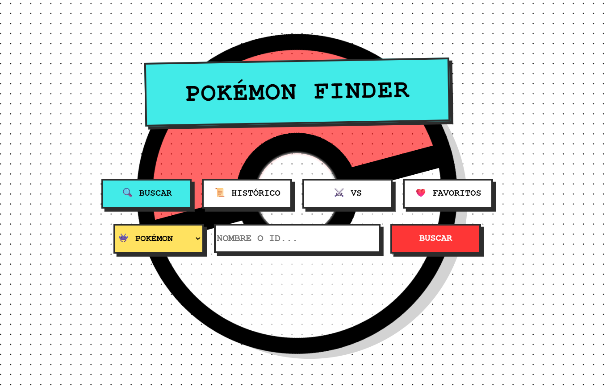
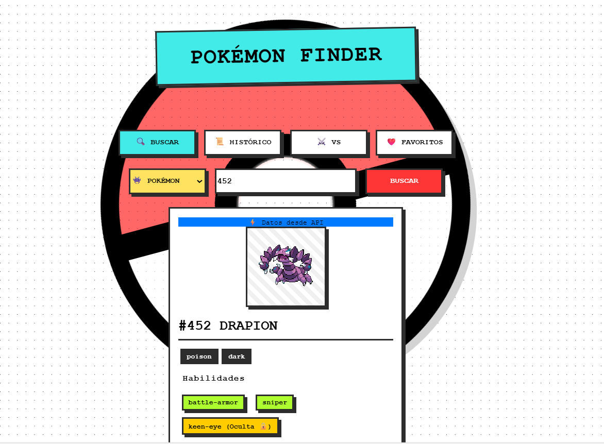
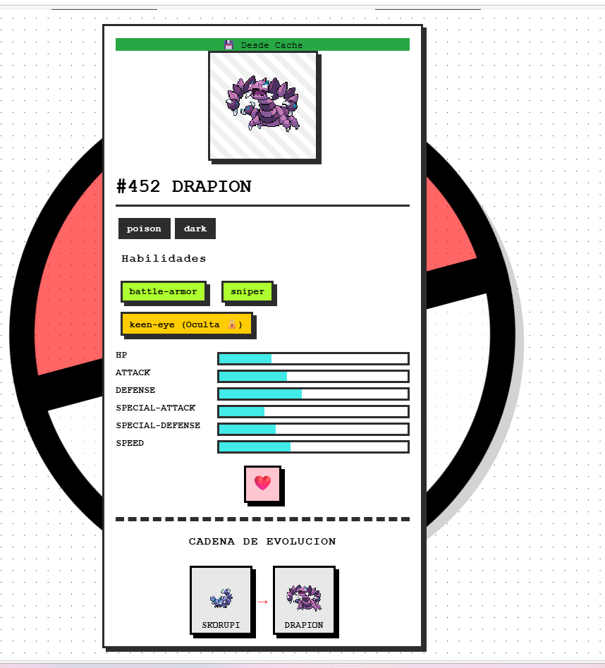
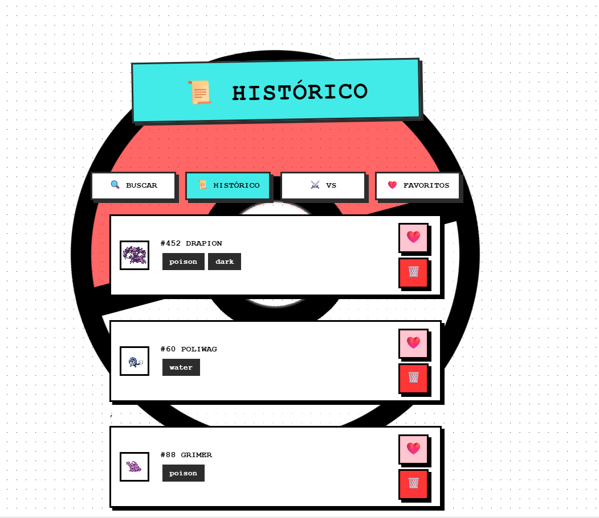
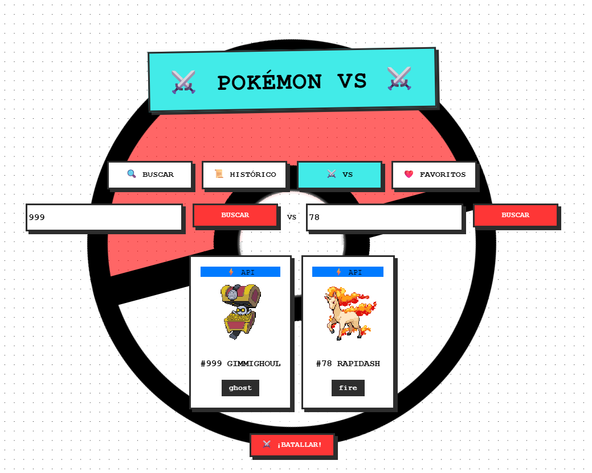
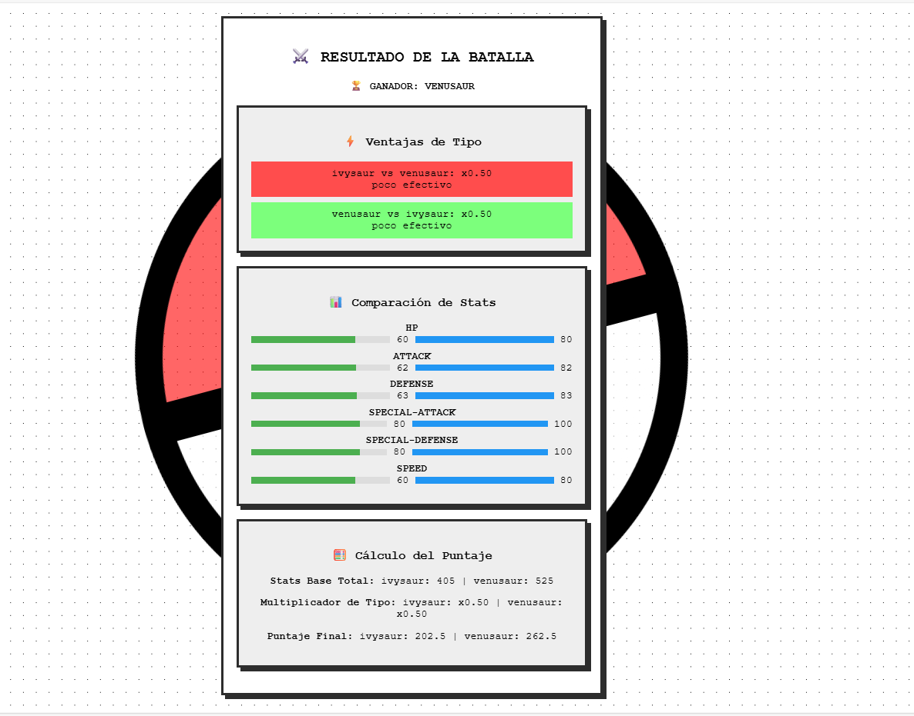
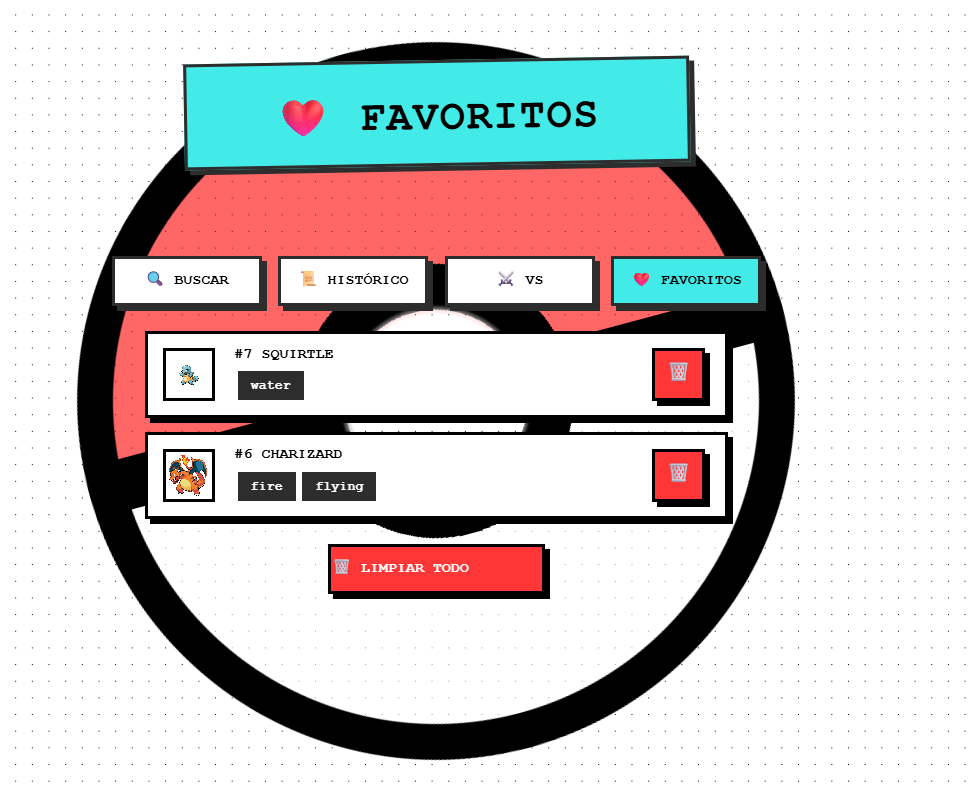

# 🎮 PokéFinder – Aplicación Web con Consumo de API

## 📌 Proyecto Semestral

**Nombre del Proyecto:** PokéFinder
**Tipo:** Aplicación Web (JavaScript Vanilla)
**API utilizada:** PokeAPI ([https://pokeapi.co/](https://pokeapi.co/))

### 👩‍💻 Integrantes
                               
* **Milena Simmons** – 8-1028-1120
* **Juan Vásquez** – 8-887-737

---

## 🎯 Objetivos de Aprendizaje

Al completar este proyecto se demuestra la capacidad de:

* Consumir APIs REST usando `fetch()` con `async / await`.
* Manipular el DOM de forma dinámica con JavaScript Vanilla.
* Implementar un sistema de caché utilizando `localStorage`.
* Gestionar estado persistente (histórico y favoritos).
* Aplicar el patrón de módulos (IIFE) para organizar el código.
* Usar delegación de eventos.
* Diseñar una interfaz responsiva con CSS moderno.
* Aplicar un diseño Brutalist con CSS personalizado.

---

## 📝 Descripción del Proyecto

**PokéFinder** es una aplicación web que permite buscar, explorar y comparar Pokémon utilizando la **PokeAPI**. El usuario puede consultar información detallada de cada Pokémon, su cadena evolutiva, habilidades, mantener un historial de búsquedas, guardar favoritos y comparar dos Pokémon en un modo VS Battle.

La aplicación sigue un **estilo Brutalist**, caracterizado por bordes gruesos, colores vibrantes y tipografía monoespaciada.

---

## 🔧 Funcionalidades

### ✅ Nivel Básico

#### 🔍 Búsqueda de Pokémon

* Búsqueda por nombre o número.
* Visualización de tarjeta con:

  * Imagen (sprite)
  * Nombre y número
  * Tipos
  * Estadísticas base (HP, Attack, Defense, Sp. Attack, Sp. Defense, Speed)
* Indicador de carga durante la búsqueda.
* Manejo de errores cuando el Pokémon no existe.

#### 💾 Sistema de Caché

* Almacenamiento de búsquedas en `localStorage`.
* Verificación del caché antes de consultar la API.
* Badge que indica el origen de los datos:

  * API
  * Caché
* Tiempo de expiración del caché: **24 horas (TTL)**.

#### 🕘 Histórico de Búsquedas

* Página independiente para visualizar el histórico.
* Listado de Pokémon buscados (más recientes primero).
* Eliminación individual de registros.
* Botón para limpiar todo el histórico y caché.
* Click en un Pokémon del histórico ejecuta la búsqueda.

#### ❤️ Sistema de Favoritos

* Botón para agregar o quitar Pokémon de favoritos.
* Página dedicada para ver favoritos.
* Persistencia usando `localStorage`.
* Opción para eliminar todos los favoritos.

---

### 🚀 Nivel Intermedio

#### 🔄 Cadena Evolutiva

* Visualización completa de la línea evolutiva.
* Sprites de cada etapa.
* Indicación del nivel o condición de evolución.
* Click en una evolución realiza la búsqueda del Pokémon seleccionado.

#### 🧠 Búsqueda por Habilidad

* Selector para cambiar el tipo de búsqueda (Pokémon / Habilidad).
* Tarjeta de habilidad con:

  * Nombre
  * Descripción en español
  * Lista de Pokémon que poseen la habilidad
* Click en un Pokémon de la lista ejecuta la búsqueda.

---

### 🆚 Nivel Avanzado – VS Battle

* Página para comparar dos Pokémon lado a lado.
* Comparación visual de estadísticas mediante barras.
* Cálculo de efectividad de tipos.
* Determinación automática del ganador.
* Posibilidad de agregar Pokémon a favoritos desde la vista VS.

---

## 🎨 Diseño – Estilo Brutalist

* Bordes gruesos (4px sólidos).
* Sombras duras sin desenfoque.
* Tipografía monoespaciada (Courier New).
* Botones con efecto de presión.
* Colores vibrantes y contrastantes.
* Bordes poco o nada redondeados.

### 🎨 Paleta de Colores (CSS Variables)

```css
:root {
  --color-bg: #f5e6d3;
  --color-primary: #2d2d2d;
  --color-accent: #ffcc00;
  --color-secondary: #ff6b6b;
  --color-success: #4ecdc4;
  --color-error: #ff6b6b;
  --color-warning: #ffa500;
  --color-api: #4ecdc4;
  --color-cache: #ffcc00;
  --color-expired: #ffa500;
  --border-width: 4px;
  --border-color: #2d2d2d;
  --shadow: 6px 6px 0px #2d2d2d;
  --font-family: 'Courier New', monospace;
}
```

---

## 📁 Estructura del Proyecto

```
📁 PokéFinder
├── index.html        # Búsqueda principal
├── historico.html    # Histórico de búsquedas
├── favoritos.html    # Pokémon favoritos
├── vs.html           # Comparador VS Battle
├── shared.css        # Estilos compartidos
└── shared.js         # Módulo de almacenamiento y utilidades
```

---

## 🌐 API Utilizada

**PokeAPI** – [https://pokeapi.co/api/v2/](https://pokeapi.co/api/v2/)

Endpoints principales:

* `/pokemon/{name|id}`
* `/pokemon-species/{name|id}`
* `/evolution-chain/{id}`
* `/ability/{name|id}`

---

## ⚠️ Restricciones del Proyecto

* ❌ No usar frameworks (React, Vue, Angular).
* ❌ No usar jQuery.
* ❌ No usar Bootstrap.
* ✅ Solo JavaScript Vanilla.
* ✅ CSS personalizado.
* ❌ No copiar código sin citar fuentes.

---

## 📤 Entrega

* Repositorio en GitHub.
* GitHub Pages habilitado.
* Este archivo **README.md** incluido.
* Capturas de pantalla del proyecto.
* Enlace del repositorio enviado por Microsoft Teams.

---

## ⭐ Bonus (Opcional)

* Tema oscuro / claro.
* Autocompletado en búsquedas.
* Sonidos de Pokémon al buscar.

## 📸 Capturas de Pantalla









## 🔗 Link a GitHub Pages
 https://java0594.github.io/Proyecto/